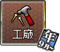
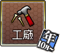

# 実装状態

| ↓期間／種別→ | 出撃 | 演習 | 遠征 | 工廠 | 改装 |
| --- | --- | --- | --- | --- | --- |
| 年1月～ | not available | not available | not available |  | not available |
| 年2月～ |  |  |  | not available |  |
| 年3月～ |  |  |  | not available | not available |
| 年4月～ | not available | not available | not available | not available | not available |
| 年5月～ | not available | not available |  | not available | not available |
| 年6月～ |  |  | not available |  | not available |
| 年7月～ | not available |  | not available |  | not available |
| 年8月～ | not available | not available |  | not available | not available |
| 年9月～ |  | not available |  |  | not available |
| 年10月～ | not available |  | not available |  | not available |
| 年11月～ | not available | not available | not available |  |  |
| 年12月～ | not available | not available | not available | not available | not available |
